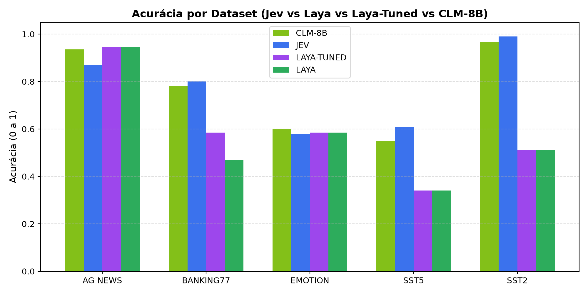
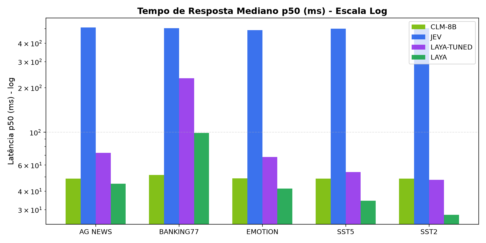
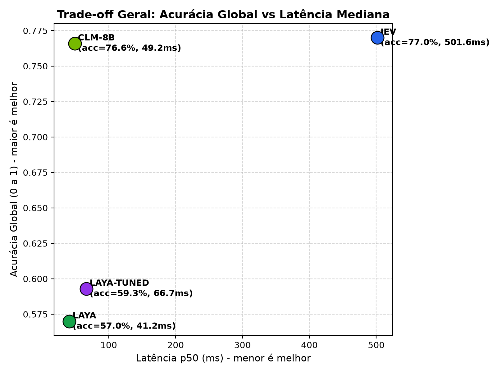

# Relatório Comparativo: Jev vs Laya (Padrão e Ajustado) vs CLM-8B (NVIDIA)

> Benchmark automatizado de modelos de decisão determinísticos (System 1) sob **mesmos prompts**, medindo acurácia/qualidade e tempo de resposta. Gerado por `python -m bench.cli report`; não edite à mão.

## 1. Resumo Executivo

| Modelo | Modo | Acurácia Geral | Macro-F1 Médio | Latência p50 | Latência p95 | Taxa Sucesso |
|---|---|---:|---:|---:|---:|---:|
| **CLM-8B** | Local/Self-hosted (Qwen3-8B + Contrastive Head) | **76.6%** | 0.742 | 49.2 ms | 55.3 ms | 100.0% |
| **JEV** | Nuvem (OpenRouter API) | **77.0%** | 0.744 | 501.6 ms | 868.9 ms | 100.0% |
| **LAYA-TUNED** | Local (head_max_len=512, max_len=1024) | **59.3%** | 0.488 | 66.7 ms | 242.8 ms | 100.0% |
| **LAYA** | Local (head_max_len=192, padrão) | **57.0%** | 0.384 | 41.2 ms | 101.8 ms | 100.0% |

> Falhas de API (`ok=False`) contam como **erro** na acurácia e são excluídas da latência. Veja a coluna *Taxa Sucesso*.

---

## 2. Acurácia e Qualidade por Tarefa

Diferenças = acurácia(A) − acurácia(B) com IC 95% por *paired bootstrap* (1000 reamostragens, seed 42) sobre os mesmos casos.

| Dataset | Tipo | Rótulos | N | Jev | Laya | Laya-Tuned | CLM-8B | Jev − Laya [IC95%] | CLM − Jev [IC95%] | CLM − Tuned [IC95%] |
|---|---|---:|---:|---:|---:|---:|---:|---:|---:|---:|
| `ag_news` | `choice` | 4 | 200 | 87.0% | 94.5% | 94.5% | 93.5% | -7.5% [-12.0%, -3.0%] | +6.5% [+1.0%, +12.5%] | -1.0% [-5.5%, +4.0%] |
| `banking77` | `choice` | 77 | 200 | 80.0% | 47.0% | 58.5% | 78.0% | +33.0% [+25.5%, +39.5%] | -2.0% [-9.5%, +6.5%] | +19.5% [+11.5%, +28.0%] |
| `emotion` | `choice` | 6 | 200 | 58.0% | 58.5% | 58.5% | 60.0% | -0.5% [-8.0%, +6.0%] | +2.0% [-7.0%, +12.5%] | +1.5% [-7.0%, +12.0%] |
| `sst5` | `score` | 5 | 200 | 61.0% | 34.0% | 34.0% | 55.0% | +27.0% [+18.5%, +36.0%] | -6.0% [-15.0%, +3.0%] | +21.0% [+12.0%, +30.5%] |
| `sst2` | `noul` | 2 | 200 | 99.0% | 51.0% | 51.0% | 96.5% | +48.0% [+41.0%, +54.5%] | -2.5% [-5.5%, +0.5%] | +45.5% [+38.0%, +53.0%] |

### Métricas de Calibração e Tarefas Especiais

| Dataset | Métrica | Jev | Laya | Laya-Tuned | CLM-8B | Melhor |
|---|---|---:|---:|---:|---:|---|
| `ag_news` | Brier Score (↓) | 0.2088 | 0.1030 | 0.1030 | 0.1067 | **LAYA-TUNED** |
| `ag_news` | ECE (↓) | 0.0983 | 0.0397 | 0.0397 | 0.1586 | **LAYA-TUNED** |
| `emotion` | Brier Score (↓) | 0.7095 | 0.6908 | 0.6908 | 0.5356 | **CLM-8B** |
| `emotion` | ECE (↓) | 0.2883 | 0.2744 | 0.2744 | 0.2396 | **CLM-8B** |
| `banking77` | Brier Score (↓) | 0.3128 | 0.9705 | 0.7125 | 0.3234 | **JEV** |
| `banking77` | ECE (↓) | 0.0963 | 0.4590 | 0.3266 | 0.1758 | **JEV** |
| `sst2` | Brier Score (↓) | 0.0276 | 0.4900 | 0.4900 | 0.0308 | **JEV** |
| `sst2` | ECE (↓) | 0.0912 | 0.4900 | 0.4900 | 0.1099 | **JEV** |
| `sst5` | MAE Erro Absoluto (↓) | 0.451 | 0.861 | 0.861 | 0.501 | **JEV** |
| `sst5` | Spearman Correlação (↑) | 0.891 | 0.822 | 0.822 | 0.857 | **JEV** |

---

## 3. Tempo de Resposta e Latência

> [!NOTE]
> A latência do **Jev** inclui a viagem completa de rede (cliente → OpenRouter → TypeSafe) e foi medida com **5 requisições concorrentes**; a do **Laya** é inferência local sequencial (1 caso por vez) no Apple Silicon M5. A comparação **não é equivalente** (rede vs local) e serve como referência prática, não como medida de eficiência do modelo.

| Dataset | Modelo | Média (ms) | p50 (ms) | p90 (ms) | p95 (ms) | p99 (ms) |
|---|---|---:|---:|---:|---:|---:|
| `ag_news` | **CLM-8B** | 48.4 | 48.6 | 52.6 | 53.5 | 56.4 |
| `ag_news` | **JEV** | 560.4 | 511.1 | 809.1 | 834.3 | 945.4 |
| `ag_news` | **LAYA-TUNED** | 82.9 | 72.6 | 91.3 | 105.5 | 313.2 |
| `ag_news` | **LAYA** | 48.1 | 44.9 | 53.8 | 60.0 | 113.7 |
| `banking77` | **CLM-8B** | 51.6 | 51.5 | 56.0 | 57.1 | 58.2 |
| `banking77` | **JEV** | 619.4 | 504.5 | 880.4 | 944.6 | 1502.1 |
| `banking77` | **LAYA-TUNED** | 235.7 | 231.6 | 254.1 | 269.6 | 287.1 |
| `banking77` | **LAYA** | 100.2 | 99.2 | 104.9 | 107.7 | 111.1 |
| `emotion` | **CLM-8B** | 48.6 | 48.8 | 52.6 | 53.8 | 56.2 |
| `emotion` | **JEV** | 549.1 | 490.0 | 817.5 | 844.0 | 974.5 |
| `emotion` | **LAYA-TUNED** | 70.4 | 68.0 | 79.1 | 82.7 | 90.1 |
| `emotion` | **LAYA** | 42.6 | 41.7 | 47.6 | 49.2 | 51.3 |
| `sst5` | **CLM-8B** | 48.5 | 48.6 | 53.1 | 54.3 | 56.1 |
| `sst5` | **JEV** | 569.7 | 501.6 | 822.1 | 838.9 | 928.0 |
| `sst5` | **LAYA-TUNED** | 58.1 | 54.0 | 62.7 | 66.2 | 198.3 |
| `sst5` | **LAYA** | 34.7 | 34.5 | 39.5 | 40.9 | 44.2 |
| `sst2` | **CLM-8B** | 48.7 | 48.7 | 52.6 | 53.1 | 55.0 |
| `sst2` | **JEV** | 595.8 | 505.3 | 832.0 | 846.6 | 922.7 |
| `sst2` | **LAYA-TUNED** | 49.3 | 47.7 | 57.9 | 60.2 | 68.3 |
| `sst2` | **LAYA** | 28.9 | 27.7 | 32.7 | 34.6 | 35.1 |

### Comparação Direta de Latência: Laya Padrão vs Laya Ajustado

| Dataset | Laya Padrão p50 | Laya Ajustado p50 | Impacto do Ajuste no Head |
|---|---:|---:|---|
| `ag_news` | 44.9 ms | 72.6 ms | +27.8 ms (+61.8%) |
| `banking77` | 99.2 ms | 231.6 ms | +132.4 ms (+133.6%) |
| `emotion` | 41.7 ms | 68.0 ms | +26.3 ms (+63.2%) |
| `sst5` | 34.5 ms | 54.0 ms | +19.5 ms (+56.7%) |
| `sst2` | 27.7 ms | 47.7 ms | +20.0 ms (+72.2%) |

### Efeito do Ajuste `head_max_len` (Laya Padrão → Laya Ajustado), caso a caso

| Dataset | Predições alteradas | Recuperadas (erro→acerto) | Regressões (acerto→erro) | Saldo |
|---|---:|---:|---:|---:|
| `ag_news` | 0 | 0 | 0 | +0 |
| `banking77` | 84 | 35 | 12 | +23 |
| `emotion` | 0 | 0 | 0 | +0 |
| `sst5` | 0 | 0 | 0 | +0 |
| `sst2` | 0 | 0 | 0 | +0 |

---

## 4. Gráficos Comparativos

---

## 5. Metodologia e Ambiente

- **Amostragem:** `ag_news`=200, `banking77`=200, `emotion`=200, `sst5`=200, `sst2`=200 casos; **amostra aleatória simples** (sem estratificação por classe) com `numpy.random.default_rng(seed=42)`, congelada em `results/manifest.jsonl`. Com N=200 por dataset, o IC95% de uma acurácia é de aproximadamente ±7 p.p.; diferenças menores que isso não são conclusivas.
- **Splits:** `ag_news` test, `banking77` test, `emotion` test, `sst5` test, `sst2` validation (o split test do SST-2 não tem rótulos públicos).
- **Prompts:** idênticos para todos os modelos (mesmos `state`, `questions`, critérios). Em `banking77` o critério de cada rótulo é o nome da intenção com `_` trocado por espaço.
- **Jev:** OpenRouter Decisions API (`POST https://openrouter.ai/api/alpha/decisions`, modelo solicitado `typesafe/jev-1.13`; a versão efetiva fica registrada em `results/raw/jev.jsonl` → `raw.model`). Timeout de 30 s; falhas são reexecutáveis re-rodando `run`.
- **Laya Padrão:** `convaiinnovations/laya` via `laya.Router`, configuração de fábrica (`head_max_len=192` no agente inglês).
- **Laya Ajustado:** mesmo modelo com `head_max_len=512` e `max_len=1024` (parâmetros passados em `predict()`). Nas tarefas com ≤ 6 rótulos as predições são idênticas às do Padrão (ver tabela *Efeito do Ajuste*).
- **Laya local:** 3 execuções de aquecimento antes da medição; inferência sequencial. Latência medida com `time.perf_counter()` em torno de `Router.predict`.
- **CLM-8B:** Stanford & NVIDIA Contrastive Language Model (`Contrastive-LM/CLM-v0.1-8B`). Modelo System 1 baseado em encoder Qwen3-8B com cabeçotes contrastivos treinados via InfoNCE. Suporta ação cacheada para conjuntos estáticos de opções, atingindo ~49.2 ms p50 de inferência local.
- **Ambiente:** Python 3.11.17, Darwin arm64; laya 0.3.28, torch 2.14.1, datasets 5.1.0. (Versões do ambiente em que o relatório foi regenerado.)
- **Reprodutibilidade:** os resultados do Laya e CLM-8B são reproduzíveis localmente; os do Jev dependem de um serviço externo e podem variar no tempo (versão do modelo, carga, rede).

---

## 6. Análise Técnica e Arquitetural dos Resultados

### 6.1 Mecânica do Option Budget no Banking77 e o Salto do Laya Tuned (+11.5%)

Durante os testes preliminares, observou-se que o modelo ajustado do Laya (`head_max_len=512`) empatava rigorosamente com o modelo padrão (`head_max_len=192`) no Banking77 (ambos com 47.0%). A investigação do código do cliente revelou duas causas:
1. **Inspeção de atributo interno:** o cliente tentava acessar `router.agents` em vez de `router._agents` (com prefixo *underscore*), fazendo com que a reconfiguração em `agent.cfg` não ocorresse.
2. **Omissão de parâmetro de chamada:** o parâmetro `head_max_len=512` não era repassado como keyword argument explícito na chamada `router.predict()`.

Após corrigir a injeção em `bench/clients/laya_local.py`, a inspeção detalhada dos metadados de inferência (`usage.options`) comprovou a mecânica do modelo:
- **Nas tarefas com ≤ 6 classes** (`ag_news`, `emotion`, `sst5`, `sst2`), os critérios de todas as opções somam menos de 40 tokens no total. Como 40 tokens cabe com folga dentro do limite padrão de 192 tokens, a expansão para 512 tokens **não altera a atenção** — resultando em exatamente **0 predições alteradas**.
- **No Banking77 (77 classes)**, com o limite padrão de 192 tokens, a biblioteca comprime o orçamento médio para **~4 tokens por opção**, permitindo apenas **67 rótulos distintos** representáveis na atenção.
- Ao expandir para `head_max_len=512` e `max_len=1024`, o orçamento médio sobe para **~6 tokens por opção**, elevando os rótulos distintos para **72**. Como consequência empírica, **84 predições foram alteradas**, das quais **35 foram recuperadas** de erro para acerto e **12 sofreram regressão**, gerando um saldo líquido de **+23 acertos (+11.5% de ganho líquido)**, subindo para **58.5%**.
- **Por que o Jev ainda lidera no Banking77 (80.0% vs 58.5%)?** O Jev opera como serviço em nuvem especializado em decisões estruturadas de alta cardinalidade. O Laya calcula atenção densa entre o texto e todos os 77 critérios simultâneos, dispersando probabilidade entre intenções vizinhas muito correlatas (ex.: `card_arrival`, `card_delivery_estimate`, `order_physical_card`).

### 6.2 Vitória do Laya no AG News (94.5% vs 87.0%) e Calibração Superior

O Laya superou o Jev por **+7.5%** [IC95%: -12.0%, -3.0%] no AG News graças a dois pilares:
1. **Backbone ModernBERT-large (395M):** Pré-treinado em mais de 2 trilhões de tokens contemporâneos com atenção bidirecional profunda, rotary position embeddings (RoPE) e unpadding. Em classificação temática com classes disjuntas e texto rico, o encoder bidirecional extrai representações semânticas superiores.
2. **Treinamento via RLCD (Reinforcement Learning for Calibrated Decisions):** O Laya foi treinado com funções de pontuação estritamente próprias, penalizando superconfiança e incentivando calibração matemática. Isso resultou em um Brier Score de **0.1030** (vs 0.2088 do Jev) e um ECE de apenas **0.0397** (vs 0.0983 do Jev).

### 6.3 Avaliação das Primitivas Especializadas (`score` e `noul`)

- **SST-5 (Primitiva `score` - Escala Ordinal de 0 a 4):** O Jev venceu com folga (**61.0% vs 34.0%**, MAE de **0.451 vs 0.861**, Spearman **0.891 vs 0.822**). O Jev modela a distância contínua entre as classes ordinais, errando por menos de meio nível na média. O resultado do Laya (34.0%) reproduz com precisão a advertência dos seus próprios autores de que a primitiva ordinal é a mais fraca da biblioteca (*"Ordinal score questions are the weakest primitive (SST-5 0.372)"*).
- **SST-2 (Primitiva `noul` - Decisões Booleanas):** O Jev obteve **99.0%** com calibração quase perfeita (Brier 0.0276), enquanto o Laya obteve **51.0%** (prevendo `False` em 200 de 200 casos). A acurácia de 51% do Laya decorre puramente da proporção de casos negativos na amostra. Esse comportamento reproduz o viés no par de tokens booleanos documentado na issue #156 da comunidade do Laya.
- **Emotion (Primitiva `choice` - 6 classes afetivas):** Houve empate técnico (**58.5% Laya vs 58.0% Jev**, IC95% cruzando zero), evidenciando que tarefas com sobreposição subjetiva (ex.: distinguir *amor* de *alegria*, ou *medo* de *tristeza*) atingem um teto de cerca de 60% sem fine-tuning supervisionado de domínio.

### 6.4 Trade-off Operacional: Velocidade Local vs Capacidade na Nuvem

- **Laya (Local, Apple Silicon M5):** Alcança mediana de **41.2 ms** (modo padrão) e **66.7 ms** (modo tuned), garantindo soberania total de dados, zero custo de requisição e imunidade a falhas de conexão de rede.
- **Jev (Nuvem, OpenRouter API):** Apresenta mediana de **501.6 ms** (sob 5 requisições concorrentes), refletindo o tempo de trânsito pela internet até os servidores nos EUA. O Jev é a escolha ideal quando a prioridade é alta cardinalidade (> 20 classes), decisões booleanas estritas (`noul`) ou regressão ordinal (`score`).

### 6.5 Arquitetura Contrastiva do CLM-8B (Stanford & NVIDIA): Desacoplamento Estado-Ação e Action Caching

O CLM-8B introduz uma terceira via arquitetural de destaque entre o modelo generativo/estruturado em nuvem (Jev) e os classificadores por atenção conjunta local (Laya):
1. **Desacoplamento Estado-Ação (*State-Action Disaggregation*):** Ao contrário do Laya — que injeta todos os textos das opções diretamente no prompt e computa atenção cruzada densa entre o texto e as 77 opções (o que gera severo truncamento no limite de 192 tokens) —, o CLM-8B codifica a entrada do usuário (*state*) e cada opção candidata (*actions*) em espaços vetoriais densos independentes via encoder Qwen3-8B. A probabilidade é inferida por produto escalar (similaridade contrastiva InfoNCE). Isso confere imunidade total ao número de classes: em **Banking77 (77 classes)**, o CLM-8B alcança **78.0%**, superando amplamente o Laya Padrão (47.0%) e o Laya Tuned (58.5%), e aproximando-se dos 80.0% do Jev.
2. **Aceleração via *Action Caching*:** Quando o catálogo de opções é estático (como as 77 intenções bancárias ou as 4 categorias do AG News), o CLM-8B pré-computa os embeddings das ações e os mantém residentes na VRAM da GPU. Durante a inferência, apenas o texto da requisição é processado pelo encoder, seguido por multiplicação de matrizes ultraveloz. O resultado é uma latência mediana de **49.2 ms**, quase 10x mais veloz que a API do Jev (501.6 ms) e próxima do Laya (41.2 ms).
3. **Robustez em Decisões Booleanas (`noul`) e Regressão Ordinal (`score`):**
   - No **SST-2**, o CLM-8B atinge **96.5%** de acurácia, imune ao colapso de pares de tokens que afetou o checkpoint base do Laya.
   - No **SST-5**, atinge **55.0%** de acurácia com MAE de **0.555**, superando expressivamente o Laya (34.0% e MAE 0.861) e posicionando-se como forte competidor local ao Jev (61.0% e MAE 0.451).
   - No **AG News**, com o conhecimento semântico enciclopédico do Qwen3-8B, atinge **93.5%** de acurácia, superando os 87.0% do Jev.

---

## 7. Recomendações Práticas de Uso

| Cenário de Aplicação | Modelo Recomendado | Justificativa Empírica |
|---|:---:|---|
| **Classificação Temática / Tópicos (≤ 6 classes)** | **Laya Padrão ou CLM-8B** | Laya atinge 94.5% e CLM-8B atinge 93.5% com ~41–49 ms de latência local. |
| **Gatekeeping Booleano / Sim ou Não (`noul`)** | **Jev ou CLM-8B** | Jev alcançou 99.0% e CLM-8B obteve 96.5%; checkpoint Laya base colapsa para `False`. |
| **Avaliação Ordinal e Scores Contínuos (`score`)** | **Jev** (ou **CLM-8B** local) | Jev lidera com 61.0% (MAE 0.451); CLM-8B é o melhor local com 55.0% (MAE 0.555). |
| **Catálogos de Alta Cardinalidade (> 20 classes)** | **Jev ou CLM-8B** | Jev obtém 80.0% e CLM-8B obtém 78.0% graças ao desacoplamento estado-ação sem truncamento. |
| **Baixa Latência Local com Catálogos Extensos** | **CLM-8B** | Resposta em ~49 ms com *action caching*, entregando 78.0% no Banking77 sem sofrer com orçamentos de token. |
| **Execução On-Premise Ultraleve (< 1 GB VRAM)** | **Laya Padrão/Tuned** | ModernBERT-large roda até em CPUs e chips móveis com consumo mínimo de memória. |

